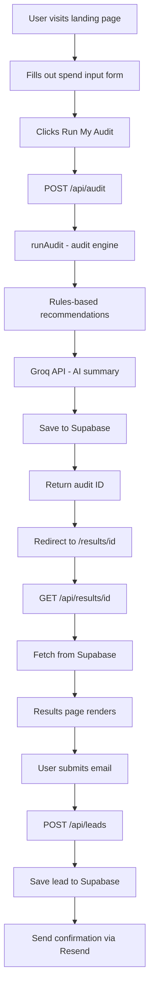

# Architecture

## System Diagram

## Data Flow

1. User fills the form — selects tools, plans, seats, monthly spend,
   team size, use case. Form state persists in localStorage so it
   survives page reloads.

2. On submit, the form POSTs to /api/audit. The audit engine runs
   purely in TypeScript — no AI involved here. It applies rules for
   each tool: is the plan right for the team size? Is there a cheaper
   alternative? Are they paying retail when credits would be cheaper?

3. The Groq API generates a ~100 word personalized summary paragraph
   based on the audit results. If Groq fails, a templated fallback
   kicks in automatically so the page never breaks.

4. The full audit (tools, recommendations, savings, AI summary) is
   saved to Supabase. The generated UUID becomes the shareable URL.

5. The results page fetches the audit from Supabase by ID and renders
   the breakdown. Email capture is shown after the results — value
   first, gate second. Leads are stored in a separate table with a
   foreign key to the audit.

## Stack Choices

**Next.js (App Router)** — Chosen because it handles both frontend
and backend in one repo. API routes live alongside the UI code, which
means one deployment on Vercel covers everything. No need for a
separate Express server.

**TypeScript** — Strongly preferred by the assignment. Caught several
bugs during development that would have been silent failures in plain
JavaScript (wrong field names in Supabase responses, incorrect type
assumptions in the audit engine).

**Tailwind CSS** — Fast to write, no context switching between files.
The dark theme with custom inline styles was easier to control with
Tailwind utilities than a separate CSS file.

**Supabase** — Free Postgres with a REST API out of the box. No ORM
needed for this scale. The SQL editor made it easy to set up the
schema quickly.

**Groq** — Chosen over Anthropic API because it has a generous free
tier with no credit card required. The llama-3.3-70b-versatile model
is fast and produces good 100-word summaries. Would switch to Claude
in production for better output quality.

**Resend** — Simplest transactional email API available. Free tier
covers 100 emails/day which is fine for launch. One API call, done.

**Vercel** — Zero-config deployment from GitHub. Auto-deploys on
every push to main. Free tier handles the expected traffic easily.

## What I'd Change at 10,000 Audits/Day

- Add a Redis cache layer in front of Supabase for repeated audit
  fetches — most shareable links get burst traffic when posted
- Move the Groq call to a background job (Vercel background functions
  or a queue) so the audit result returns instantly and the AI summary
  loads async
- Add a CDN for the results page (it's mostly static once generated)
- Rate limit the /api/audit endpoint more aggressively — currently
  only has a basic honeypot, would add proper IP-based rate limiting
- Split the leads table into a proper CRM pipeline with status
  tracking (new, contacted, converted)
- Add proper error monitoring (Sentry) instead of console.error